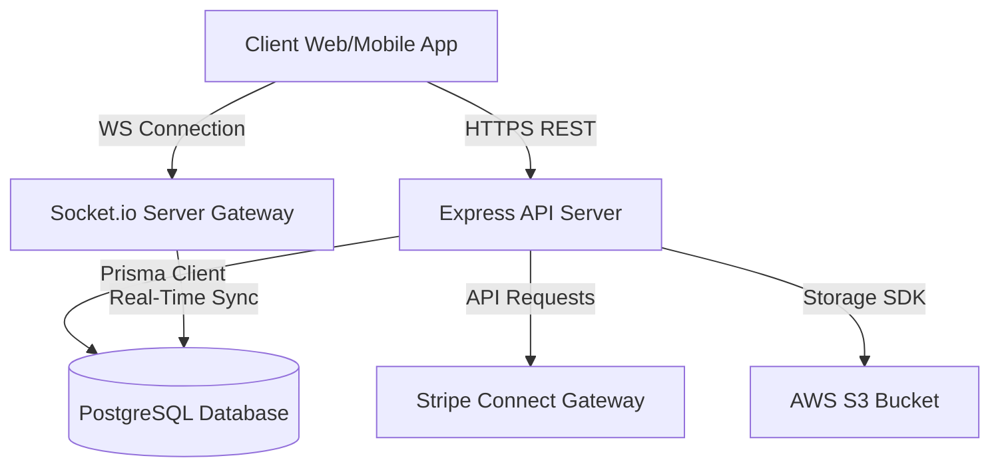

# Zelper Service Marketplace Backend

Zelper is a premium service marketplace platform linking customers needing tasks done with verified local helpers. This repository contains the production-grade, highly scalable backend API built with Express, TypeScript, Prisma ORM, PostgreSQL, Socket.io, and Stripe.

---

## Technical Stack
- **Core**: Node.js, Express, TypeScript
- **Database & ORM**: PostgreSQL, Prisma ORM
- **Real-Time Communication**: Socket.io (Presence, Chat, Negotiations & Alerts)
- **Payment & Escrow Infrastructure**: Stripe (Checkout Sessions, Connect Transfers, Webhooks)
- **File Storage**: AWS S3 (Multer S3 SDK)
- **Email Delivery**: SMTP NodeMailer
- **Environment & Deployment**: Docker, Docker Compose, PM2 / Alpine Linux

---

## Core System Architecture



---

## Primary Modules & Features

### 1. User & Helper Management
- Auth system supporting standard email/password and OAuth (Google).
- Helper profile onboarding with verification document submission.
- Admin controls to review, verify (`VERIFIED`), or reject (`REJECTED`) helper accounts.

### 2. Job Posts & Applications Lifecycle
- **OPEN**: Customers create tasks with detailed specs, location data, and budget parameters (fixed or negotiable). Helpers apply.
- **ASSIGNED**: Customer selects a helper application and funds the escrow budget via Stripe.
- **IN_PROGRESS**: Helper confirms task execution start.
- **WAITING_FOR_APPROVAL**: Helper completes the work and requests completion review.
- **COMPLETED**: Customer approves work completion, automatically triggering payment release.
- **CLOSED**: Customer reviews the helper, finishing the lifecycle.

### 3. Escrow Payments & Connect Payouts
- **Secure Escrow**: Customer funds are securely held in Stripe until job completion.
- **Instant Withdrawals**: Automated payouts transferring helper balances instantly to their linked Stripe Express account using Stripe Connect transfers.
- **Webhook Integration**: Robust payment event handling checking signatures, resolving budgets, and managing transaction ledger histories.

### 4. Real-Time Chat & Budget Negotiation (Socket.io)
- **Budget Counter Offers**: Direct client-to-helper price negotiation with event-driven counter proposals (`send_offer`, `accept_offer`, `reject_negotiation`).
- **Private Conversations**: Instant messages (`send_message`, `message_seen`) with S3-backed image/document upload attachments.
- **Presence Tracking**: Online/offline indicators across all active connections.

### 5. Review & Rating System
- Post-job completed review submissions recalculating the helper's `rating_average`, `total_reviews` and `completed_jobs` dynamically in single-query database transactions.

### 6. Notifications
- Database-recorded notifications pushed in real-time to active socket client rooms (`user:userId`) for job lifecycle updates, helper approvals, payments, and payouts.

---

## Local Development Installation

### Prerequisites
- Node.js (v20.x or higher)
- PostgreSQL database instance
- Stripe and AWS account credentials

### Step-by-Step Setup

1. **Clone the Repository**:
   ```bash
   git clone https://github.com/modasser-nayem/zelper-server.git
   cd zelper-server
   ```

2. **Install Dependencies**:
   ```bash
   npm install
   ```

3. **Configure Environment Variables**:
   Copy `.env.example` to `.env` and fill in your credentials:
   ```bash
   cp .env.example .env
   ```

4. **Initialize Prisma Database Schema**:
   Run database migrations to initialize tables and relationships:
   ```bash
   npx prisma migrate dev
   ```

5. **Generate Prisma Client**:
   ```bash
   npx prisma generate
   ```

6. **Seed Database (Optional Admin/Default Records)**:
   ```bash
   npx prisma db seed
   ```

7. **Run the Server**:
   - **Development Mode** (Hot reloading):
     ```bash
     npm run dev
     ```
   - **Production Mode** (Build and start):
     ```bash
     npm run build
     ```

---

## Running with Docker (Recommended)

The project includes a multi-stage `Dockerfile` and a `docker-compose.yml` service definition mapping the Express app container alongside a local PostgreSQL instance.

### Prerequisites
- Docker and Docker Compose installed locally.

### Start the Services

1. **Configure Environment Variables**:
   Ensure `.env` contains the correct credentials. To connect to the database container running inside Docker Compose, set:
   ```env
   DATABASE_URL="postgresql://postgres:mysecretpassword@db:5432/someone-help?schema=public"
   PORT=5014
   ```

2. **Build and Run Containers**:
   ```bash
   docker compose up --build -d
   ```

3. **Verify running containers**:
   ```bash
   docker compose ps
   ```

4. **Execute Database Migrations inside App Container**:
   ```bash
   docker compose exec api npx prisma migrate deploy
   ```

5. **Stop Containers**:
   ```bash
   docker compose down
   ```

---

## Integration Specifications
- **Socket Specifications**: See [Socket.io API Document Specification](./src/socket/README.md) for full descriptions of listener/emit payloads.
- **REST APIs**: Import the provided [Zelper.postman_collection.json](./Zelper.postman_collection.json) to quickly interact with the endpoints.
